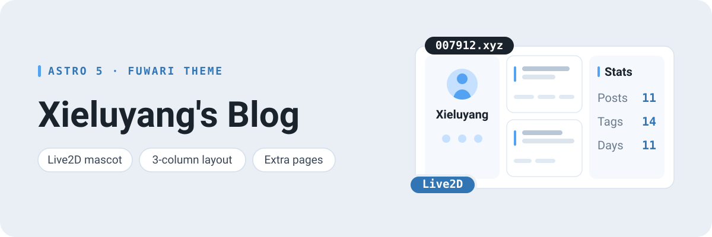

<p align="center">
  <picture>
    <source media="(prefers-color-scheme: dark)" srcset="../assets/readme/hero-dark.svg">
    
  </picture>
</p>

# 🍥 บ้านหลังเล็กของ Xieluyang


บล็อกส่วนตัวของผม ใช้จดบันทึกการเรียน สิ่งที่ลองผิดลองถูก และเรื่องอื่น ๆ ที่คิดว่าควรค่าแก่การเขียนเก็บไว้

สร้างด้วย [Astro](https://astro.build) บนธีม [Fuwari](https://github.com/saicaca/fuwari) พร้อมตัวละคร Live2D เลย์เอาต์สามคอลัมน์ และหน้าพิเศษอีกหลายหน้าที่พอร์ตมาจากธีม [Mizuki](https://github.com/LyraVoid/Mizuki)

**🖥️ อ่านได้ที่ [007912.xyz](https://007912.xyz)**


🌏 **README ภาษา:** [English](../README.md) · [中文](README.zh-CN.md) · [日本語](README.ja.md) · [한국어](README.ko.md) · [Español](README.es.md) · [Tiếng Việt](README.vi.md) · [Bahasa Indonesia](README.id.md)

## ✨ คุณสมบัติ

**การเขียน**

- [ไวยากรณ์ Markdown ส่วนขยาย](#-ไวยากรณ์-markdown-ส่วนขยาย) —— กล่องข้อความเน้น การ์ดที่เก็บโค้ด GitHub และบล็อกโค้ด [Expressive Code](https://expressive-code.com/) ที่มีเลขบรรทัดและส่วนที่พับเก็บได้
- สารบัญ (TOC) ในทุกบทความ
- ค้นหาทั้งเว็บไซต์ด้วย [Pagefind](https://pagefind.app/) พร้อมฟีด RSS
- ระบบคอมเมนต์ด้วย [giscus](https://giscus.app/)

**รูปลักษณ์**

- โหมดสว่าง / มืด ปรับแต่งสีธีมและภาพแบนเนอร์ได้
- ดีไซน์ตอบสนองทุกขนาดหน้าจอ พร้อมการเปลี่ยนหน้านุ่มนวลด้วย [Swup](https://swup.js.org/)
- สร้างด้วย [Astro](https://astro.build) และ [Tailwind CSS](https://tailwindcss.com)

**เพิ่มเติมจากธีม Fuwari ต้นฉบับ**

- ตัวละคร Live2D ที่มุมล่างซ้าย เรนเดอร์ด้วย [oh-my-live2d](https://github.com/hacxy/oh-my-live2d)
- คอลัมน์ที่สามทางด้านขวา —— สถิติเว็บไซต์ ปฏิทินบทความ และหมวดหมู่
- หน้าพิเศษ: [โปรเจกต์](https://007912.xyz/projects/), [ทักษะ](https://007912.xyz/skills/), [เครื่องมือ AI](https://007912.xyz/ai-tools/) และ [ไทม์ไลน์](https://007912.xyz/timeline/)

## 🚀 เริ่มต้นใช้งาน

1. **เอาโค้ดไปใช้** fork ที่เก็บโค้ดนี้ หรือ[สร้างที่เก็บโค้ดใหม่](https://github.com/Xieluyang912/fuwari/generate)จากเทมเพลตนี้

    ถ้าอยากได้ธีม Fuwari ต้นฉบับที่**ไม่มี**การปรับแต่งข้างต้น ให้ใช้คำสั่งเหล่านี้แทน:

    ```sh
    npm create fuwari@latest
    yarn create fuwari
    pnpm create fuwari@latest
    bun create fuwari@latest
    deno run -A npm:create-fuwari@latest
    ```

2. **ติดตั้ง dependencies** ด้วย `pnpm install` ถ้ายังไม่มี [pnpm](https://pnpm.io) ให้รัน `npm install -g pnpm` ก่อน
3. **ตั้งค่าบล็อกของคุณ** ใน `src/config.ts` ทั้งชื่อเว็บไซต์ แบนเนอร์ การ์ดโปรไฟล์ แถบนำทาง คอมเมนต์ ตัวละคร Live2D แถบด้านข้าง และหน้าพิเศษ ตั้งค่าได้ทั้งหมดที่นี่
4. **เขียนบทความแรก** ด้วย `pnpm new-post <ชื่อไฟล์>` แล้วแก้ไขไฟล์ในโฟลเดอร์ `src/content/posts/`
5. **Deploy** ตั้งค่า `site` และ `base` ใน `astro.config.mjs` จากนั้นทำตาม[คู่มือการ deploy ของ Astro](https://docs.astro.build/en/guides/deploy/) ขึ้น Vercel, Netlify, GitHub Pages ฯลฯ

## 📝 Frontmatter (ส่วนหัวไฟล์) ของโพสต์

```yaml
---
title: My First Blog Post
published: 2023-09-09
description: This is the first post of my new Astro blog.
image: ./cover.jpg
tags: [Foo, Bar]
category: Front-end
draft: false
lang: th      # ใส่เฉพาะเมื่อภาษาของโพสต์ต่างจากภาษาของเว็บไซต์ที่ตั้งไว้ใน `config.ts`
---
```

## 🧩 ไวยากรณ์ Markdown ส่วนขยาย

นอกจาก [GitHub Flavored Markdown](https://github.github.com/gfm/) ที่ Astro รองรับอยู่แล้ว เว็บนี้ยังเปิดใช้ฟีเจอร์ Markdown เพิ่มเติมอีกหลายอย่าง:

- **Admonitions (กล่องข้อความเน้น)** เขียนในรูปแบบ directive:

  ```md
  :::note
  ข้อมูลที่ผู้อ่านควรให้ความสนใจเป็นพิเศษ
  :::

  :::tip
  ข้อมูลเสริมที่ช่วยให้เข้าใจได้ดียิ่งขึ้น
  :::
  ```

- **การ์ดที่เก็บโค้ด GitHub** แทรกด้วย directive `github`:

  ```md
  ::github{repo="saicaca/fuwari"}
  ```

- **บล็อกโค้ดแบบปรับปรุง** ด้วย [Expressive Code](https://expressive-code.com/) รองรับเลขบรรทัด ส่วนที่พับเก็บได้ และปุ่มคัดลอก

## ⚡ คำสั่ง

คำสั่งทั้งหมดให้รันจากโฟลเดอร์รากของโปรเจกต์:

| Command                    | Action                                              |
|:---------------------------|:----------------------------------------------------|
| `pnpm install`             | ติดตั้ง dependencies                                |
| `pnpm dev`                 | เปิดเซิร์ฟเวอร์สำหรับพัฒนาที่ `localhost:4321`          |
| `pnpm build`               | บิลด์เว็บไซต์สำหรับ production ไปที่ `./dist/`          |
| `pnpm preview`             | ดูตัวอย่างผลลัพธ์การบิลด์ในเครื่องก่อน deploy            |
| `pnpm check`               | ตรวจหาข้อผิดพลาดในโค้ด                                |
| `pnpm format`              | จัดรูปแบบโค้ดด้วย Biome                               |
| `pnpm new-post <filename>` | สร้างบทความใหม่                                       |
| `pnpm astro ...`           | รันคำสั่ง CLI เช่น `astro add`, `astro check`          |
| `pnpm astro --help`        | แสดงความช่วยเหลือของ Astro CLI                        |

## 🙏 เครดิต

- [Fuwari](https://github.com/saicaca/fuwari) —— ธีมที่เว็บไซต์นี้สร้างขึ้นมา
- [Mizuki](https://github.com/LyraVoid/Mizuki) —— ต้นทางของตัวละคร Live2D แถบด้านขวา และเมนู "Others"
- [oh-my-live2d](https://github.com/hacxy/oh-my-live2d) —— ไลบรารีสำหรับเรนเดอร์ Live2D
- [Astro](https://astro.build) · [Svelte](https://svelte.dev) · [Tailwind CSS](https://tailwindcss.com)
- [Pagefind](https://pagefind.app/) · [Swup](https://swup.js.org/) · [giscus](https://giscus.app/) · [Expressive Code](https://expressive-code.com/)

## 📄 สัญญาอนุญาต

ส่วนของธีมเผยแพร่ภายใต้ [MIT License](../LICENSE) ส่วนเนื้อหาบทความใช้สัญญาอนุญาต [CC BY-NC-SA 4.0](https://creativecommons.org/licenses/by-nc-sa/4.0/)
